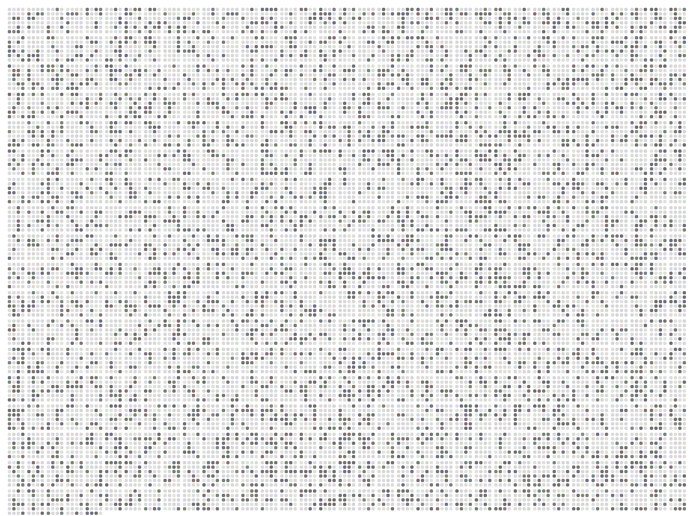

#  dot-cloud

> a DER SPIEGEL visualization




## Original article

[The Deaths Putin Is Seeking to Keep Quiet](https://www.spiegel.de/international/world/data-on-russia-s-dead-the-deaths-vladimir-putin-is-keeping-quiet-a-df2473a2-7d59-4708-b255-1a5f8e2d49ca)


## Data input in `public`

[`data.csv`](./public/data.csv): The data foundation for the dots

[`config.json`](./public/config.json): Configuration of the different chapters

[`russia_comp.geojson`](./public/russia_comp.geojson): GeoJSON file of russian provinces

[`russia_squares.geojson`](./public/russia_squares.geojson): GeoJSON file of russian provinces as square tile cartogram 


## Run locally

```
git clone https://github.com/spiegelgraphics/dot-cloud.git
cd dot-cloud
npm install
npm run dev
```


## The `R` folder

contains an R project to calculate randomized data.


## Built by

the [DER SPIEGEL](https://www.spiegel.de) graphics desk, 2023.

The application was slightly changed compared to its original to be able to run it outside of a dedicated CMS. Also the app is using a random value data set.


## License

Apache License Version 2.0